## About

[Zenodo](https://about.zenodo.org/) is an open-source repository used to archive and share any research data. A Digital Object Identifier (DOI) is assigned to any file submitted, and all data are stored at the European Organization for Nuclear Research  [(CERN)](https://www.home.cern/).

This document intends to describe and provide what is needed for searching and uploading data on [CONTRAST community](https://zenodo.org/communities/contrast) in Zenodo. 

## Sign up/ Log in to Zenodo

|  |  |  
| :------- | :----------- |
|   1. Go to [zenodo.org](https://zenodo.org/) and click on _Sign Up_ on the top-left corner of the site.You can jump to [the next step](#jump) if you already have an account.     | 
|   2.There are several ways to create an account, but we strongly recommend signing up with your [ORCID](https://orcid.org/).Using ORCID ensures that authors have a persistent identifier, improving visibility and reusability of your work. If you don’t have an ORCID yet, we recommend creating one before proceeding.|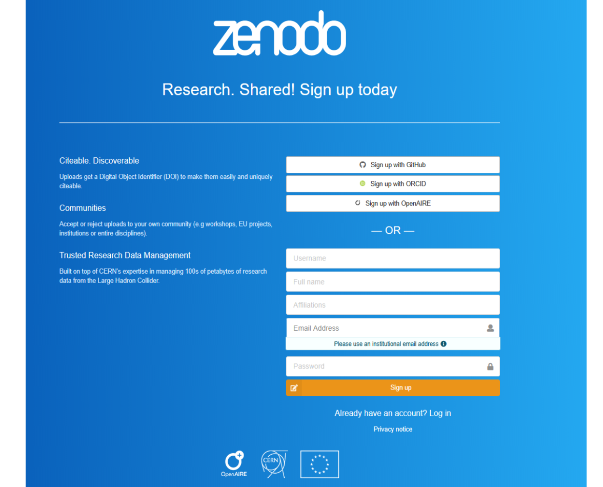{width=500px}|
|3. After signing up you must open your e-mail inbox and confirm your e-mail by clicking Confirm my account.| 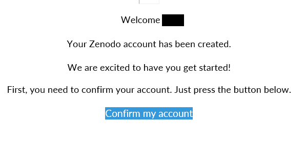 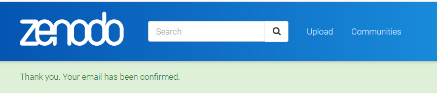|        

 

## Find CONTRAST community

| | |
| :------- | :----------- |
1.  Click on _Communities_ on the banner on the top of the page.| |

| | |
| :------- | :----------- |
2. Search for _CONTRAST_ **on the _Communities_ search field** and press enter (note that you will not find the community by using the general search field).| 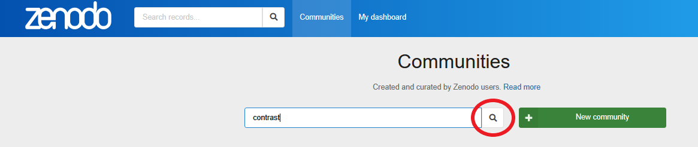|

| | |
| :------- | :----------- |
3. You will find the CONTRAST community below. Click on the title.| 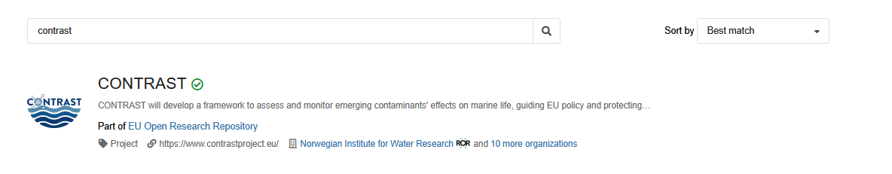{width=500px}|

| | |
| :------- | :----------- |
4. All uploaded files have tags identifying date uploaded, type of file, and type of access.|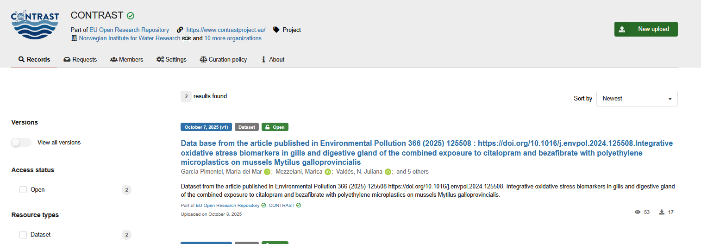{width=500px}|

**Description of tags:**

- Uploaded date: Month,DD,YYY(version)
- Type of file: Dataset; Presentation; Poster, etc 
- Type of access:
    - Open 
    - Embargoed - The file will be given open access from a date specified by the publisher (the date can be changed after upload).
    - Restricted - Access can be requested. Conditions for access can be given by the publisher.
          

  

## Before you start your upload

Please follow the **naming conventions**, **data types**, and **format guidelines** defined in the project’s **Data Management Plan (DMP)** whenever possible.  
The summary below provides key extracts from the DMP (_Chapter: Datasets_).  
For updates or clarification, always refer to the most recent version of the DMP.  

---

### Naming Conventions

Whenever possible, name your data files according to the following format:

`_WPnumber_TaskNumber_PartnerAcronym_Easy-to-understand-content_date_`

**Example:**

`_WP5_T5.3_NIVA_Bioassay-CampaignXX-sediment_14.03.2024_`

This structure helps ensure clarity, traceability, and alignment across project partners.

### Main Deliverable Types

| **Type of Data** | **Characteristics** | **Possible Formats** |
|------------------|--------------------|----------------------|
| **Chemical and physicochemical data** | Concentrations of CECs and legacy contaminants in different matrices; physicochemical properties such as temperature, salinity, oxygen, suspended particle matter (SPM), and dissolved organic matter (DOM). | **Recommended:** `.csv`, `.tab` **Accepted:** `.xls`, `.xlsx` |
| **Biological data** | Information regarding living organisms, encompassing genomics (and other omics data), physiological parameters, and related aspects (e.g., field, lab, mesocosm). | **Recommended:** `.csv`, `.tab` **Accepted:** `.xls`, `.xlsx` |
| **Computational data** | Data produced by computer simulations, modelling, algorithms, or software applications (e.g., model outputs). | **Recommended:** NetCDF **Also:** [Upload the corresponding GitHub repository to Zenodo](https://help.zenodo.org/docs/github/enable-repository/) |
| **Reports / Policy briefs / Workshops** | Scientific reports, workshop abstracts, policy briefs, internal documents, and similar outputs. | **Recommended:** Open Document Format (`.odf`) **Accepted:** `.pdf`, `.html`, `.docx`, `.xlsx`, `.rtf` |

---

_This extract summarises relevant sections from the CONTRAST DMP (v1.2, October 2025). In case of discrepancies, the DMP takes precedence._

## Uploading files

| | |
| :------- | :----------- |
|- Click on New upload |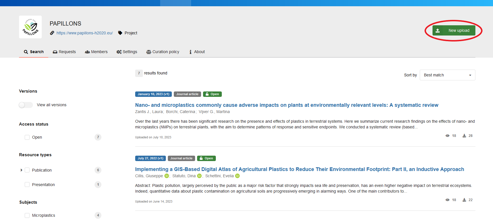|
|- Ensure that the community is selected to submit your record. If you see the community logo on the top of the upload section, [jump here](#jump-com-upload).  |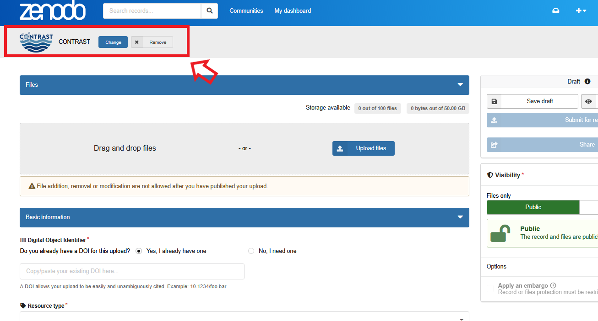|
|- If it is not, click on Select a community on the top the upload section.| 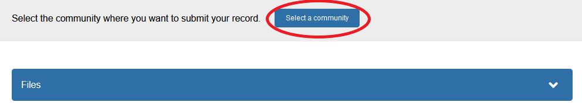|
|- Search for CONTRAST and click on _Select_.| |
|-  Upload your file(s) by either drag and drop or by clicking on Upload files.|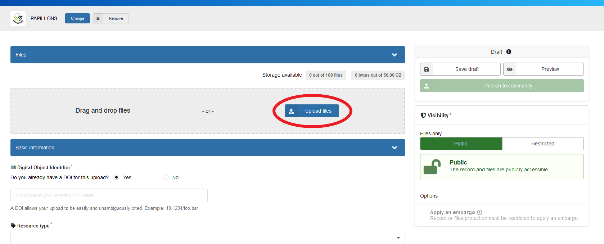|
- Choose the visibility of your upload. If you choose Public, your file will be open source. if you choose Restricted, the files will be only accessible by users specified in the permissions.| 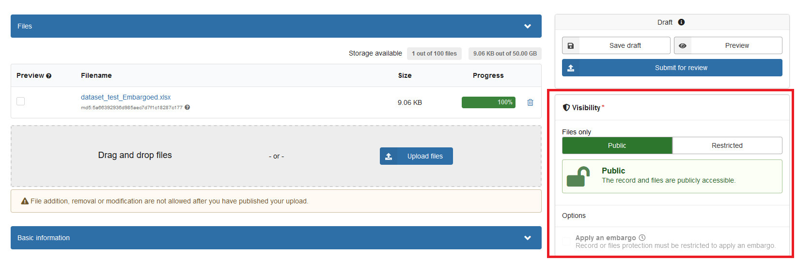|
It is also possible to apply an embargo| 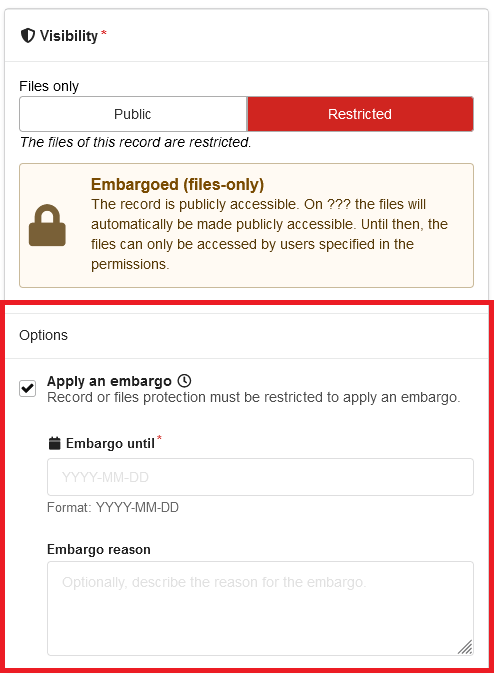|
- Most fields on the _Basic Information_ section are required (marked with *).|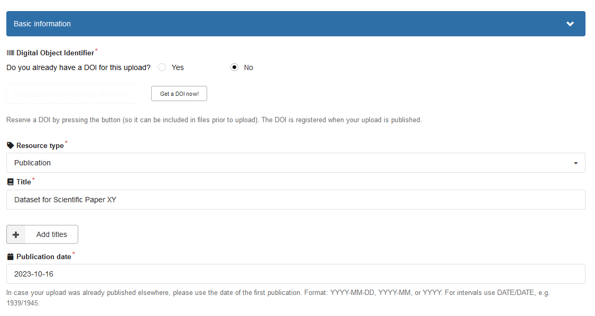|
- Once you are ready to submit, click on Submit for review. It is also possible to save a draft.| |
- Once your upload is completed, it will be searchable on Zenodo, but not yet connected to the CONTRAST community. A curator (community owner) will receive your request to include your file in the community repository and approve it if the community requirements are fulfilled (if any).||
- You can find all your uploads (including drafts) by clicking on _My dashboard_ on the top banner.|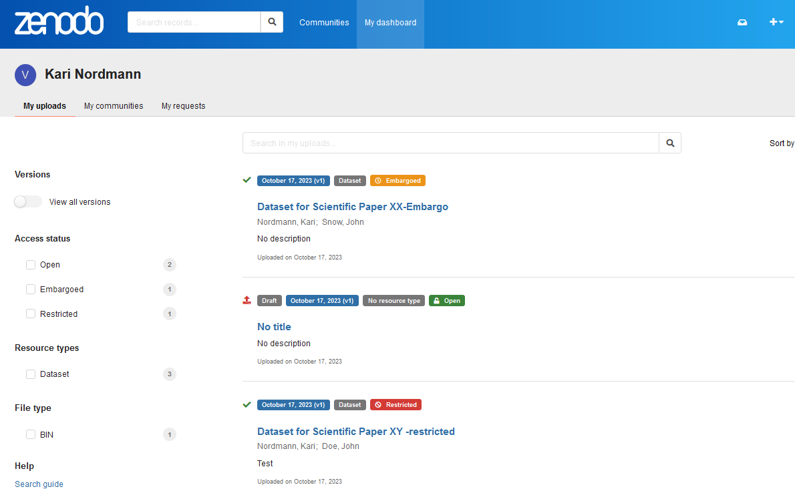|

## Uploading datasets

- Make sure to name the file according to CONTRAST's DMP

- Make sure to add a description about the dataset (raw file, quantitative/qualitative data, link to article, etc).

- Whenever possible, upload your datasets in .csv format. .csv files are supported by a wide range of software applications than Excel, making it more accessible. They are also lighter due to its simplicity (lacking of formatting).

- Tag your data with file type  Dataset . This will make your file easier to find.

- It is possible to upload your dataset together with other materials, but it is preferable to upload it on its own. This is to ensure your data are findable when searching for datasets. In this case you will want to link it to your publication: 
    -	go to the publication, click on Edit, and fill out the field Related works. 
    
    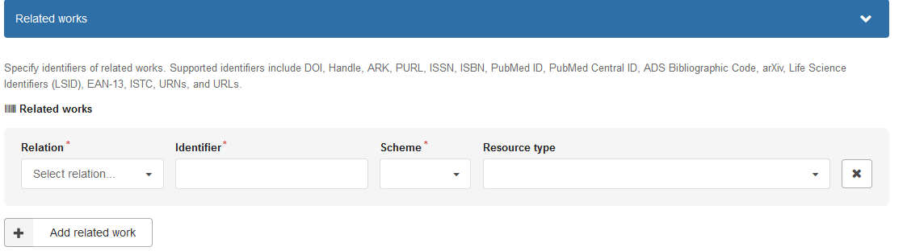

## Useful links

- [About Zenodo](https://about.zenodo.org/)
- [Frequently Asked Questions](https://help.zenodo.org/faq/)
- [Link to an OAI-PMH feed, which can be used by other digital repositories to harvest this community.](https://sandbox.zenodo.org/oai2d?verb=ListRecords&set=user-CONTRAST-test&metadataPrefix=oai_dc)
- [Make Your Code Citable Using GitHub and Zenodo: A How-to Guide](https://genr.eu/wp/cite/)

 

